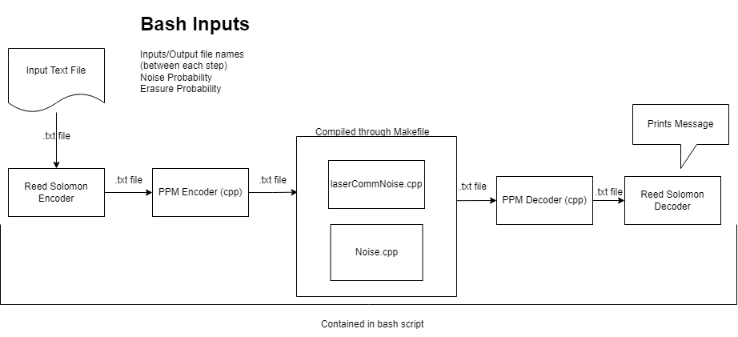
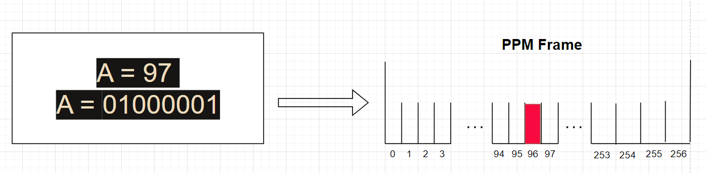

# Instructions on how to compile
## Prerequisites
Make sure you have the following installed on your system:
- GCC (GNU Compiler Collection) for compiling C++ code
- Python 3.x for running Python scripts
- Make utility
- Bash shell

### Clone the Repository
First, clone the repository to your local machine:
```bash
git clone https://github.com/iansmorrison/StarShot_UCSB_team.git
cd StarShot_UCSB_team/marlonNoiseSim
```
## Using the Makefile
Some of the C++ code can be compiled using the provided Makefile. To compile this code, simply run:
```
make
```

The remaining C++ code, along with the pipeline execution and input handling, is managed by the main.sh script. This difference of compilation will make sense once the simulation is moved onto hardware, which requires multiple computers. To run this script, use:
```
chmod +x main.sh
./main.sh
```
## Run the main.sh file

There are various parameters relating to the pipeline that may be altered based on each run of the pipeline.

To run the entire pipeline with default settings, execute:
```
./main.sh
```

## Directory Structure
* src/: Contains C++ source files
* include/: Contains C++ header filers
* test/: Contains test files
* python_scripts/: Contains Python scripts
* data/: Contains input data for analyzing and simulation
* output/ Contains outputs of pipeline
* Makefile: For compiling specific C++ code
* main.sh: Bash script for compiling remaining C++ code, running the pipeline, and handling inputs

## Room for future improvement
- Proper decoding algorithm, efficiency for error correction decoders
- Characterizing pipeline through additional test scrips
- Stress testing error correction coding through brute force parameterization of pipeline

## Pipeline




### Binary Conversion Example


